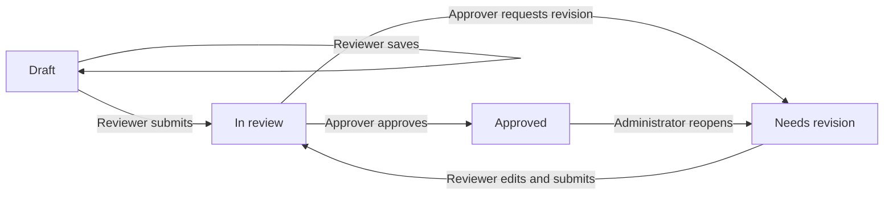

# GMD Canonical Variable Schema

The GMD Canonical Variable Schema (CVS) is the governed knowledge base for
AI-assisted household survey harmonization. It translates the GMD
harmonization guidelines into versioned records that are readable by people,
validated by software, and consumable by harmonization agents.

The CVS answers one question consistently: **given the evidence available in
a survey, what rules must be followed to construct a specific GMD variable?**
It does not inspect raw surveys, generate final harmonization code, or replace
human approval.

## How the system fits together

The wider harmonization workflow uses three schemas:

| Stage | Schema | Responsibility |
|---|---|---|
| 1 | Survey Profile | Describes variables and evidence found in a raw survey. |
| 2 | Canonical Variable Schema (this repository) | Defines the universal GMD rules and governed country-specific inputs. |
| 3 | Harmonization Specification | Records the proposed mapping for one survey and variable. |

For each harmonization run, this repository supplies an **effective canon**:

```text
effective canon = universal CVS + applicable country records
```

The universal layer defines structure, value codes, derivation relationships,
and decision rules. The country layer supplies parameter values and permitted
exceptions for an ISO3 country code and survey ID year. Country records may be
more specific, but they never override universal structure.

## Repository map

| Path | Purpose |
|---|---|
| `knowledge/` | Universal variable, rule, parameter, module, rubric, and exception artifacts. `knowledge/index.md` is the registry. |
| `country-parameters/` | Country parameter values and exceptions, organized by uppercase ISO3 code. |
| `schema/` | Pydantic models and Markdown front-matter loader used for validation. |
| `validation/` | Cross-repository structural and governance checks. |
| `build/` | Compiler that produces one runtime JSON bundle for a country and optional survey year. |
| `extraction/` | Staging workflow for turning source guidelines into reviewed CVS artifacts. |
| `extraction_pipeline/` | Deterministic guideline extraction pipeline (preflight, source resolution, AST parsing, gates, agents, orchestrator). |
| `governance/` | Project audits, open questions, decision records, and implementation traceability. |
| `docs/` | Existing explanatory examples and schema notes. |
| `wiki/` | Detailed project documentation and operating guidance. |
| `AGENTS.md` | Mandatory operating and write-access rules for AI agents. |

Markdown with YAML front matter is the governed source format. Files under
`build/output/` are generated runtime artifacts and must not be hand edited.

## Quick start

Requirements: Python 3.10 or later, Git, and a checkout with an available
`HEAD` commit.

```sh
python3 -m venv .venv
source .venv/bin/activate
python3 -m pip install -r requirements.txt
python3 validation/validate_country_layer.py
python3 build/compile_bundle.py PER 2019
```

The validator prints reports for undecided fallbacks, country coverage gaps,
unverified values, and structural failures. It exits with status 1 only when
structural failures are found; governance reports can contain open items while
the command still succeeds.

The compiler writes `build/output/bundle_PER_2019.json`. It validates the
universal parameter registry, country records, references, and ISO3 identity;
selects records whose inclusive validity window contains 2019; and embeds the
current Git commit hash. Omit the year to include every country record and its
validity window:

```sh
python3 build/compile_bundle.py PER
```

The current compiler produces development bundles. It includes every artifact
under `knowledge/` and does not yet publish an explicit approved-variable
allowlist. Do not use these bundles for production Foundry harmonization until
the approved-subset runtime gate described below is implemented.

## Authoring and governance

The authoritative source for CVS rules is
`GMD_household_survey_harmonization.md` in the
`GMD-hub/GMD-guidelines` repository. When a CVS artifact conflicts with that
source, the source wins and the conflict must be escalated to the GPID Team.

New artifacts follow this lifecycle:

```text
source/context -> agent draft -> human review -> approved staging -> knowledge
```

AI agents write drafts to `extraction/20_drafts/`. Humans own review,
approval, and promotion into `knowledge/` and `country-parameters/`. Never
invent a rule or parameter value; use `null` where the source is insufficient
and document the missing evidence in provenance.

Project-level audits and decision records live under `governance/`. They are
review records, not canonical CVS artifacts and not official wiki pages.

Read `AGENTS.md` before making any change. Before a harmonization run, read
`knowledge/index.md`, the relevant variable and rule files, and
`country-parameters/README.md` plus both files for the survey country.

## Production review workflow

The review application gets its application code from `main/review-app` and
stores review data on a separate protected branch. The branches have different
purposes:

| Branch | Purpose | Normal writes |
|---|---|---|
| `main` | Application code, canonical `knowledge/`, schemas, and documentation | Normal reviewed PRs |
| `review-production` | Active review records, reviewed Markdown bodies, events, and approved staging outputs | Atomic GitHub App commits created by human actions; exceptional queue-control changes use a dedicated PR to this branch |
| `review` | Preserved six-record calibration queue and data rollback | None; legacy compatibility is read-only |

Never merge `review-production` into `main`. Promotion copies and reconciles
selected approved content through a normal feature branch and PR based on
`main`.

### Review states and roles

Roles are exact. Reviewers edit and submit, approvers decide, and
administrators assign work or reopen approved records. An administrator does
not inherit reviewer or approver actions. Administrators can also re-enroll a
non-approved record from a verified immutable source commit. An approved record
must be reopened before re-enrollment.



Each successful action creates one atomic commit on `review-production`:

| Action | Result on `review-production` |
|---|---|
| Administrator assignment | Updates the review record assignment and event history. |
| Reviewer save | Writes `extraction/30_review/<artifact_id>.body.md` and updates the review record without changing its state. |
| Reviewer submit | Moves the review record from `draft` or `needs-revision` to `in-review`. |
| Approver request revision | Records the reason and moves the record to `needs-revision`. |
| Approver approve | Moves the record to `approved` and maps `extraction/20_drafts/<module>/<artifact_id>.md` to `extraction/40_approved/<module>/<artifact_id>.md`. |
| Administrator reopen | Moves the record to `needs-revision` and removes the active approved output in the same commit. |
| Administrator re-enroll source | Verifies and records a new immutable source; keeps `draft` unchanged or moves `in-review` to `needs-revision`. |

Approval also requires an approval-enabled queue, a distinct reviewer and
approver, an `in-review` record, a valid current source binding, no blocker,
and no existing approved destination.

## Releasing an approved subset

The team does not need to approve all 267 records before preparing an initial
subset. A set of 12-15 variables can enter promotion when each selected
variable has completed the review-app cycle. Variables outside that set remain
in the review queue and are not eligible for harmonization.

Review-app approval is an approved staging decision. It is not, by itself, a
canonical or Foundry-ready release. The review app preserves source YAML front
matter while reviewers edit the human-readable Markdown body. The current
schemas accept only draft and unreviewed metadata, so this promotion procedure
is a target contract and is not yet executable end to end. After the approved
metadata and runtime gate are implemented, the selected subset must complete
these steps:

1. Select one current protected `review-production` head. At that exact commit,
   require each selected record to remain `approved` and require its active
   output hash to match its approval event. Never promote from a historical
   output that was later reopened.
2. Record each approved variable ID, review-record path and hash, approved-output
   path and hash, and the exact `review-production` commit.
3. Reconcile each approved Markdown body with its structured YAML fields. The
   promoted artifact must use an approved lifecycle state and reviewed
   provenance accepted by the production schema.
4. Compute the complete dependency closure. Recursively include `derived_from`
   and prerequisites; include referenced rules, parameters, modules, applicable
   country values, and applicable exceptions. Use `derives_to` and
   `applies_to_variables` as reverse consistency checks, not as permission to
   harmonize additional variables. Reject unresolved or unreviewed dependencies.
5. Create a normal feature branch from `main`. Copy and reconcile only the
   selected approved artifacts into `knowledge/`; do not merge the review data
   branch.
6. Update `knowledge/index.md` and record the approved status and version for
   every promoted artifact.
7. Immediately before merging, recheck the current `review-production` head.
   Stop if any selected record was reopened, changed, or lost its active output.
8. Run schema, provenance, reference, derivation, and country-layer validation,
   then merge the promotion PR after human review.
9. Recheck the current `review-production` head immediately before release
   publication and deployment. Then build from the exact merged `main` commit
   in a clean detached checkout. The release must contain an explicit
   `approved_variable_ids` allowlist, only the required approved dependency
   closure, an artifact inventory with hashes, and a final bundle hash.
10. Point the Foundry agent to that immutable release and verify one allowed and
    one disallowed variable before production use.

A variable is ready for Foundry only when it is promoted on `main`, is listed
in the release's `approved_variable_ids`, is present in the matching runtime
bundle, and is bound to verified approval and canonical hashes in a typed
release manifest. Presence in `extraction/20_drafts/`,
`extraction/30_review/`, `extraction/40_approved/`, or a review branch is not
enough.

The typed release manifest is the single machine authority. It must bind the
release ID, merged `main` commit, source `review-production` commit, each
approved review record and output hash, each promoted canonical path and hash,
the callable variable IDs, included dependency IDs and hashes, country/year
scope, and final bundle hash. The release builder must reject dirty worktrees,
draft or unreviewed artifacts, missing dependencies, undecided blocking
fallbacks, and unverified country records. The allowlist must be generated from
verified approval and promotion evidence; it must never be accepted as a
free-form operator list.

A published release is immutable. A later reopen is prospective: it makes the
variable ineligible for the next release but does not rewrite an existing
release. If a reopen addresses a material error, the operator must suspend the
current release in Foundry immediately and keep it suspended until a reviewed
replacement or revocation release is deployed.

### Foundry fail-closed instruction

The production harmonization agent is configured in the Microsoft Foundry
portal, outside this repository. Add the following instruction to that agent
after the approved-subset runtime release is available:

```text
Use only the supplied CVS runtime release. You may harmonize a variable only
when its exact variable_id appears in approved_variable_ids and the matching
artifact is present in the same release.

If approved_variable_ids is absent, empty, unreadable, or does not contain the
requested variable_id, stop. Also stop if the matching artifact or dependency
is missing, unreadable, malformed, unapproved, hash-mismatched, outside the
release scope, or bound to an unverifiable release commit. State that the
variable is not approved for harmonization and escalate to the GPID Team. Do
not infer approval from a file, a review state, prior knowledge, or a similar
variable.

Never use artifacts from extraction/20_drafts, extraction/30_review,
extraction/40_approved, review, or review-production as runtime canon. Use only
the pinned main-branch release and record its commit_hash and variable_id in the
Harmonization Specification.
```

This instruction is defense in depth, not the authorization boundary. A
deterministic guard outside the language model must check the exact requested
ID against the immutable release manifest before model invocation and reject
missing, malformed, case-altered, or unlisted IDs. It must also verify output
provenance after invocation. The release compiler and external guard are
tracked in the project roadmap and must be completed before the first
production Foundry harmonization.

## Documentation

The wiki provides the detailed operating guide:

- [Complete wiki index](wiki/Learning-Paths.md)
- [System overview](wiki/index.md)
- [Architecture and data flow](wiki/Architecture.md)
- [Repository map](wiki/Repository-Map.md)
- [Artifact model](wiki/Artifact-Model.md)
- [Artifact lifecycle](wiki/Artifact-Lifecycle.md)
- [Country parameter layer](wiki/Country-Parameter-Layer.md)
- [Validation and runtime bundles](wiki/Validation-and-Builds.md)
- [Governance and contribution workflow](wiki/Governance-and-Contributing.md)
- [Glossary](wiki/Glossary.md)
- [Governance records](governance/README.md)

The authoritative artifact inventory remains `knowledge/index.md`.
