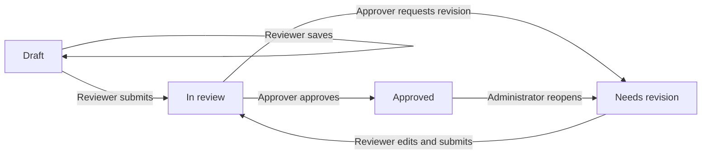
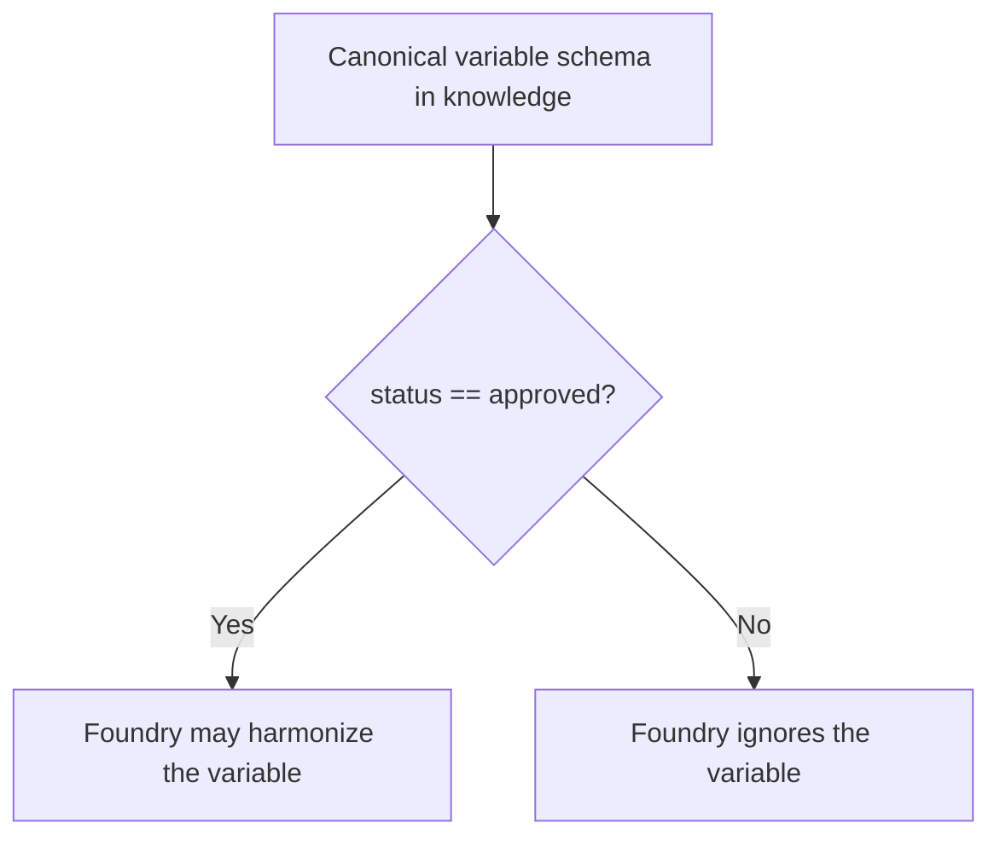

# GMD Canonical Variable Schema

The GMD Canonical Variable Schema (CVS) is the governed knowledge base for
AI-assisted household survey harmonization. It translates the GMD
harmonization guidelines into versioned records that are readable by people,
validated by software, and consumable by harmonization agents.

The CVS answers one question consistently: **given the evidence available in
a survey, what rules must be followed to construct a specific GMD variable?**
It does not inspect raw surveys, generate final harmonization code, or replace
human approval.

## How the system fits together

The wider harmonization workflow uses three schemas:

| Stage | Schema | Responsibility |
|---|---|---|
| 1 | Survey Profile | Describes variables and evidence found in a raw survey. |
| 2 | Canonical Variable Schema (this repository) | Defines the universal GMD rules and governed country-specific inputs. |
| 3 | Harmonization Specification | Records the proposed mapping for one survey and variable. |

For each harmonization run, this repository supplies an **effective canon**:

```text
effective canon = universal CVS + applicable country records
```

The universal layer defines structure, value codes, derivation relationships,
and decision rules. The country layer supplies parameter values and permitted
exceptions for an ISO3 country code and survey ID year. Country records may be
more specific, but they never override universal structure.

## Repository map

| Path | Purpose |
|---|---|
| `knowledge/` | Universal variable, rule, parameter, module, rubric, and exception artifacts. `knowledge/index.md` is the registry. |
| `country-parameters/` | Country parameter values and exceptions, organized by uppercase ISO3 code. |
| `schema/` | Pydantic models and Markdown front-matter loader used for validation. |
| `validation/` | Cross-repository structural and governance checks. |
| `build/` | Compiler that produces one runtime JSON bundle for a country and optional survey year. |
| `extraction/` | Staging workflow for turning source guidelines into reviewed CVS artifacts. |
| `extraction_pipeline/` | Deterministic guideline extraction pipeline (preflight, source resolution, AST parsing, gates, agents, orchestrator). |
| `governance/` | Project audits, open questions, decision records, and implementation traceability. |
| `docs/` | Existing explanatory examples and schema notes. |
| `wiki/` | Detailed project documentation and operating guidance. |
| `AGENTS.md` | Mandatory operating and write-access rules for AI agents. |

Markdown with YAML front matter is the governed source format. Files under
`build/output/` are generated runtime artifacts and must not be hand edited.

## Quick start

Requirements: Python 3.10 or later, Git, and a checkout with an available
`HEAD` commit.

```sh
python3 -m venv .venv
source .venv/bin/activate
python3 -m pip install -r requirements.txt
python3 validation/validate_country_layer.py
python3 build/compile_bundle.py PER 2019
```

The validator prints reports for undecided fallbacks, country coverage gaps,
unverified values, and structural failures. It exits with status 1 only when
structural failures are found; governance reports can contain open items while
the command still succeeds.

The compiler writes `build/output/bundle_PER_2019.json`. It validates the
universal parameter registry, country records, references, and ISO3 identity;
selects records whose inclusive validity window contains 2019; and embeds the
current Git commit hash. Omit the year to include every country record and its
validity window:

```sh
python3 build/compile_bundle.py PER
```

The compiler preserves each variable's `status` and can produce mixed
development bundles. A Foundry ingestion corpus must select only approved
variables. If Foundry reads the canonical schema directly from GitHub, it must
check the status before using each variable.

## Authoring and governance

The authoritative source for CVS rules is
`GMD_household_survey_harmonization.md` in the
`GMD-hub/GMD-guidelines` repository. When a CVS artifact conflicts with that
source, the source wins and the conflict must be escalated to the GPID Team.

New artifacts follow this lifecycle:

```text
source/context -> agent draft -> human review -> approved staging -> knowledge
```

AI agents write drafts to `extraction/20_drafts/`. Humans own review,
approval, and promotion into `knowledge/` and `country-parameters/`. Never
invent a rule or parameter value; use `null` where the source is insufficient
and document the missing evidence in provenance.

Project-level audits and decision records live under `governance/`. They are
review records, not canonical CVS artifacts and not official wiki pages.

Read `AGENTS.md` before making any change. Before a harmonization run, read
`knowledge/index.md`, the relevant variable and rule files, and
`country-parameters/README.md` plus both files for the survey country.

## Production review workflow

The review application gets its application code from `main/review-app` and
stores review data on a separate protected branch. The branches have different
purposes:

| Branch | Purpose | Normal writes |
|---|---|---|
| `main` | Application code, canonical `knowledge/`, schemas, and documentation | Normal reviewed PRs |
| `review-production` | Active review records, reviewed Markdown bodies, events, and approved staging outputs | Atomic GitHub App commits created by human actions; exceptional queue-control changes use a dedicated PR to this branch |
| `review` | Preserved six-record calibration queue and data rollback | None; legacy compatibility is read-only |

Never merge `review-production` into `main`. Promotion copies and reconciles
selected approved content through a normal feature branch and PR based on
`main`.

### Review states and roles

Roles are exact. Reviewers edit and submit, approvers decide, and
administrators assign work or reopen approved records. An administrator does
not inherit reviewer or approver actions. Administrators can also re-enroll a
non-approved record from a verified immutable source commit. An approved record
must be reopened before re-enrollment.



Each successful action creates one atomic commit on `review-production`:

| Action | Result on `review-production` |
|---|---|
| Administrator assignment | Updates the review record assignment and event history. |
| Reviewer save | Writes `extraction/30_review/<artifact_id>.body.md` and updates the review record without changing its state. |
| Reviewer submit | Moves the review record from `draft` or `needs-revision` to `in-review`. |
| Approver request revision | Records the reason and moves the record to `needs-revision`. |
| Approver approve | Moves the record to `approved` and maps `extraction/20_drafts/<module>/<artifact_id>.md` to `extraction/40_approved/<module>/<artifact_id>.md`. |
| Administrator reopen | Moves the record to `needs-revision` and removes the active approved output in the same commit. |
| Administrator re-enroll source | Verifies and records a new immutable source; keeps `draft` unchanged or moves `in-review` to `needs-revision`. |

Approval also requires an approval-enabled queue, a distinct reviewer and
approver, an `in-review` record, a valid current source binding, no blocker,
and no existing approved destination.

## Releasing an approved subset

The team does not need to approve all 267 records before using an initial
subset. A set of 12-15 variables can move forward when each selected variable
has completed the review-app cycle. Variables outside that set remain `draft`
and Foundry ignores them.

Review-app approval creates an approved staging artifact under
`extraction/40_approved/`. To make a selected variable available to Foundry:

1. Reconcile its approved Markdown body with the structured YAML fields.
2. Create a normal feature branch from `main`; never merge
   `review-production` into `main`.
3. Promote the reconciled variable into `knowledge/` with `status: approved`,
   `provenance.human_reviewed: true`, and the recorded reviewer.
4. Update `knowledge/index.md` to show the same approved status and version.
5. Validate the schema and merge the promotion PR after human review.

That is the complete Foundry eligibility rule:



Presence in a draft, review record, review branch, or approved staging folder
is not sufficient. The canonical variable under `knowledge/` must have the
exact field:

```yaml
status: approved
```

All other status values are ineligible. The production harmonization agent is
configured in the Microsoft Foundry portal, outside this repository. Its
instruction must include:

```text
Use only the canonical variable schema from knowledge/. Before harmonizing a
variable, read its exact status field. Harmonize it only when status is
approved. Ignore every variable whose status is missing or has any other value.
Never use extraction drafts, review records, review branches, or approved
staging files as canonical harmonization input.
```

## Documentation

The wiki provides the detailed operating guide:

- [Complete wiki index](wiki/Learning-Paths.md)
- [System overview](wiki/index.md)
- [Architecture and data flow](wiki/Architecture.md)
- [Repository map](wiki/Repository-Map.md)
- [Artifact model](wiki/Artifact-Model.md)
- [Artifact lifecycle](wiki/Artifact-Lifecycle.md)
- [Country parameter layer](wiki/Country-Parameter-Layer.md)
- [Validation and runtime bundles](wiki/Validation-and-Builds.md)
- [Governance and contribution workflow](wiki/Governance-and-Contributing.md)
- [Glossary](wiki/Glossary.md)
- [Governance records](governance/README.md)

The authoritative artifact inventory remains `knowledge/index.md`.
