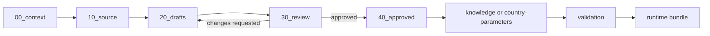

# Artifact Lifecycle

## From guidelines to canon

The staging folders preserve the distinction between extraction, review, and
canonical publication. Content must not jump directly from source material to
`knowledge/`.

## Stage responsibilities

### 1. Context and source

`00_context/` holds material needed to interpret a scoped extraction.
`10_source/` holds the authoritative excerpt or source input used for the
candidate artifact. The project-wide rule source remains
`GMD_household_survey_harmonization.md` in `GMD-hub/GMD-guidelines`.

### 2. Draft

An agent writes one candidate artifact per variable, rule, parameter, or other
canonical record to `20_drafts/`. The draft must:

- trace every rule and value to source evidence;
- follow naming and schema conventions;
- leave undetermined values null instead of guessing;
- explain missing evidence in provenance notes;
- retain `status: draft` and `human_reviewed: false` until humans act;
- avoid mixing multiple variables in one artifact.

### 3. Human review

Humans record review notes and decisions in `30_review/`. Review should check
semantic fidelity to the guidelines, not only YAML validity. In particular,
reviewers inspect IF/THEN logic, derivation links, country specificity,
fallback consequences, provenance, and test examples.

Requested changes return to the draft stage. Agents do not write review
decisions or approve their own output.

### 4. Approval and promotion

Humans place approved candidates in `40_approved/`, then promote them to the
correct canonical folder. Promotion includes:

- placing universal artifacts under the appropriate `knowledge/` path;
- placing country values or exceptions under `country-parameters/`;
- updating `knowledge/index.md` for universal artifact inventory changes;
- running validation and any relevant bundle compilation;
- committing the promoted state so bundles can record its exact hash.

`40_approved/` is a staging checkpoint, not a runtime input. The compiler reads
from `knowledge/` and `country-parameters/` only.

## Changes to existing artifacts

Treat modifications like new extraction work: establish source evidence,
draft the change, obtain review, and promote it. Human approval is always
required for:

- any new or modified file under `knowledge/`;
- any change to rule IF/THEN logic;
- any change to `derived_from` or `derives_to`;
- any addition or modification under `country-parameters/`;
- any change to `AGENTS.md`.

Never change an artifact from `active` to another status, and never move
country-specific facts into the universal layer.

## Definition of done

A canonical change is complete when its source and provenance are clear,
human approval is recorded, the artifact is promoted to the owning folder,
the index is current, structural validation succeeds, governance reports have
been reviewed, and representative runtime bundles compile as expected.
