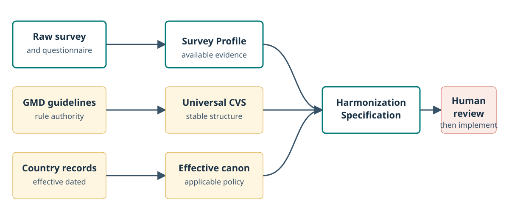
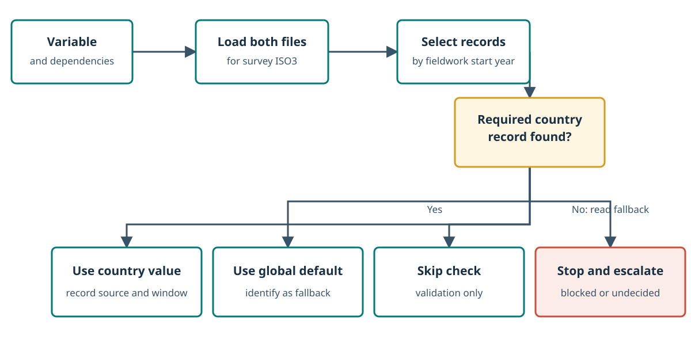
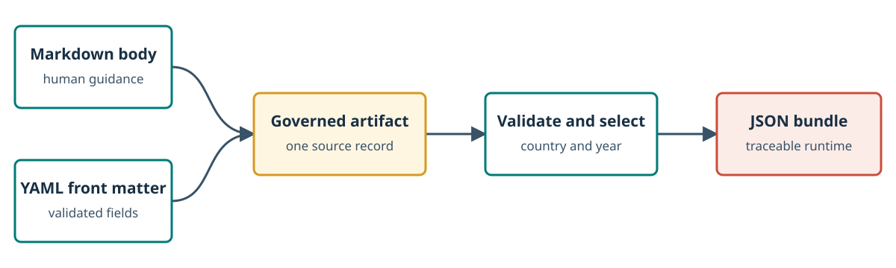

# Architecture and Data Flow

## The three-schema workflow

The CVS is the policy layer between survey discovery and an executable
harmonization decision.

<figure class="gmd-diagram" markdown>

<figcaption>Survey evidence and governed policy meet in a proposal that remains subject to human review.</figcaption>
</figure>

The Survey Profile describes available evidence. The effective canon describes
the rules and country inputs that apply. A downstream harmonization agent
combines both to draft a Harmonization Specification for a particular survey
and variable. Human review occurs before implementation. The agent may use a
canonical variable only when its exact `status` is `approved`; it ignores draft
variables.

## Trace one decision through the system

!!! example "Hypothetical example: evidence meets policy"
    This scenario is invented to make the interfaces concrete. It does not
    describe a real survey or establish a country value.

    A fictional survey asks for the respondent's current grade and whether
    they are enrolled. The Survey Profile records those questions as evidence;
    it does not decide the final value of `VAR-educy`.

    The effective canon contributes the universal `VAR-educy` contract, its
    referenced education rule, and any country records valid in the year
    fieldwork began. A Harmonization Specification can then propose which raw
    fields to use, which construction path applies, and which country record
    was selected. A reviewer checks that proposal before code is implemented.

| Interface | Receives | Produces | Does not decide |
|---|---|---|---|
| Survey Profile | Raw questionnaire and metadata | Structured survey evidence | Canonical policy |
| Effective canon | Universal CVS plus selected country records | Applicable rules and inputs | Which raw field is the best match |
| Harmonization Specification | Survey evidence plus effective canon | One traceable mapping proposal | Its own approval |

## The two canonical layers

### Universal CVS

`knowledge/` defines concepts that must remain stable across countries:

- variable identity, type, allowed values, and missing codes;
- derivation relationships and prerequisites;
- reusable decision rules and prohibitions;
- parameter definitions, value shapes, and fallback policies;
- universal modules, rubrics, and exceptions when they are added.

### Country Parameter Layer

`country-parameters/countries/<ISO3>/` contains only:

- values for parameter IDs registered under `knowledge/parameters/`;
- conditional country exceptions scoped to existing variable IDs.

It cannot redefine universal structure. A country exception cannot change
value codes, data types, missing codes, or the derivation graph.

## Effective-canon resolution

For every variable in every run, the consumer loads the survey country's
`parameters.md` and `exceptions.md`. It selects records whose inclusive
validity window contains the survey ID year, defined as the calendar year in
which fieldwork began.

<figure class="gmd-diagram" markdown>

<figcaption>A valid country record is preferred; otherwise the universal fallback policy controls the outcome.</figcaption>
</figure>

`country_parameters` on a variable is a completeness declaration. It does not
control whether the country layer is loaded; loading is unconditional.

!!! example "Hypothetical example: why unconditional loading matters"
    Imagine that `VAR-educy` declares an education-duration parameter, while a
    valid country exception also applies to a legacy questionnaire code. If a
    consumer loaded only declared parameters and skipped `exceptions.md`, it
    would miss applicable governed logic. Loading both files first prevents
    declarations from becoming an accidental routing mechanism.

## Authoring and runtime representations

<figure class="gmd-diagram" markdown>

<figcaption>Human-readable Markdown and structured front matter travel together into the runtime representation.</figcaption>
</figure>

YAML front matter carries fields software can validate. The Markdown body
holds definitions, construction notes, rationale, examples, escalation
triggers, and change history. The compiler preserves both by adding the body
as a string in the generated JSON.

## Precedence rules

1. Universal CVS always controls structure.
2. Within the country layer's allowed scope, a valid country record is more
   specific than a global default.
3. If no valid country value exists, the universal parameter definition's
   fallback policy controls behavior.
4. A fallback policy of `undecided` means stop and escalate, never improvise.

## Suggested reading

- **To locate each box in the repository:** continue to the
    [Repository Map](Repository-Map.md).
- **To inspect the records flowing between boxes:** read the
    [Artifact Model](Artifact-Model.md).
- **To understand selection and fallback in detail:** read the
    [Country Parameter Layer](Country-Parameter-Layer.md).

## All wiki pages

[Home](index.md) | [Learning Paths](Learning-Paths.md) |
[Architecture](Architecture.md) | [Repository Map](Repository-Map.md) |
[Artifact Model](Artifact-Model.md) |
[Country Parameter Layer](Country-Parameter-Layer.md) |
[Artifact Lifecycle](Artifact-Lifecycle.md) |
[Validation and Builds](Validation-and-Builds.md) |
[Governance and Contributing](Governance-and-Contributing.md) |
[Glossary](Glossary.md)
