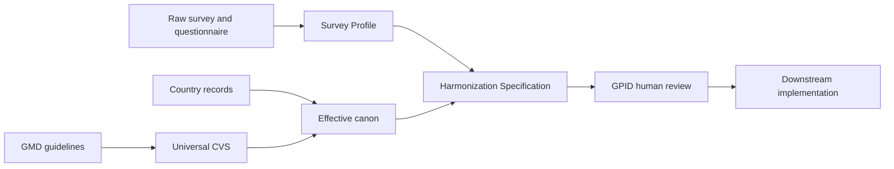
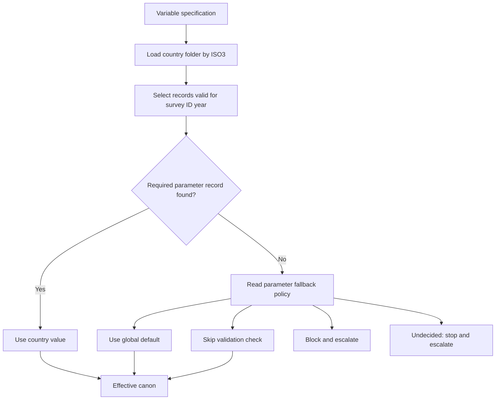
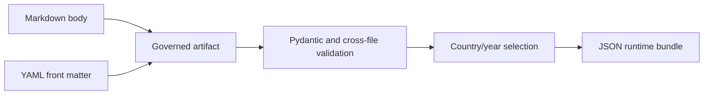

# Architecture and Data Flow

## The three-schema workflow

The CVS is the policy layer between survey discovery and an executable
harmonization decision.

The Survey Profile describes available evidence. The effective canon describes
the rules and country inputs that apply. A downstream harmonization agent
combines both to draft a Harmonization Specification for a particular survey
and variable. Human review occurs before implementation.

## The two canonical layers

### Universal CVS

`knowledge/` defines concepts that must remain stable across countries:

- variable identity, type, allowed values, and missing codes;
- derivation relationships and prerequisites;
- reusable decision rules and prohibitions;
- parameter definitions, value shapes, and fallback policies;
- universal modules, rubrics, and exceptions when they are added.

### Country Parameter Layer

`country-parameters/countries/<ISO3>/` contains only:

- values for parameter IDs registered under `knowledge/parameters/`;
- conditional country exceptions scoped to existing variable IDs.

It cannot redefine universal structure. A country exception cannot change
value codes, data types, missing codes, or the derivation graph.

## Effective-canon resolution

For every variable in every run, the consumer loads the survey country's
`parameters.md` and `exceptions.md`. It selects records whose inclusive
validity window contains the survey ID year, defined as the calendar year in
which fieldwork began.

`country_parameters` on a variable is a completeness declaration. It does not
control whether the country layer is loaded; loading is unconditional.

## Authoring and runtime representations

YAML front matter carries fields software can validate. The Markdown body
holds definitions, construction notes, rationale, examples, escalation
triggers, and change history. The compiler preserves both by adding the body
as a string in the generated JSON.

## Precedence rules

1. Universal CVS always controls structure.
2. Within the country layer's allowed scope, a valid country record is more
   specific than a global default.
3. If no valid country value exists, the universal parameter definition's
   fallback policy controls behavior.
4. A fallback policy of `undecided` means stop and escalate, never improvise.

## Related documents

- [Artifact Model](Artifact-Model.md) defines the records shown in the flows.
- [Country Parameter Layer](Country-Parameter-Layer.md) details country resolution.
- [Validation and Runtime Bundles](Validation-and-Builds.md) explains compilation.

## All wiki pages

[Index](Index.md) | [Home](Home.md) | [Architecture](Architecture.md) | [Repository Map](Repository-Map.md) | [Artifact Model](Artifact-Model.md) | [Artifact Lifecycle](Artifact-Lifecycle.md) | [Country Parameter Layer](Country-Parameter-Layer.md) | [Validation and Builds](Validation-and-Builds.md) | [Governance and Contributing](Governance-and-Contributing.md) | [Glossary](Glossary.md)
